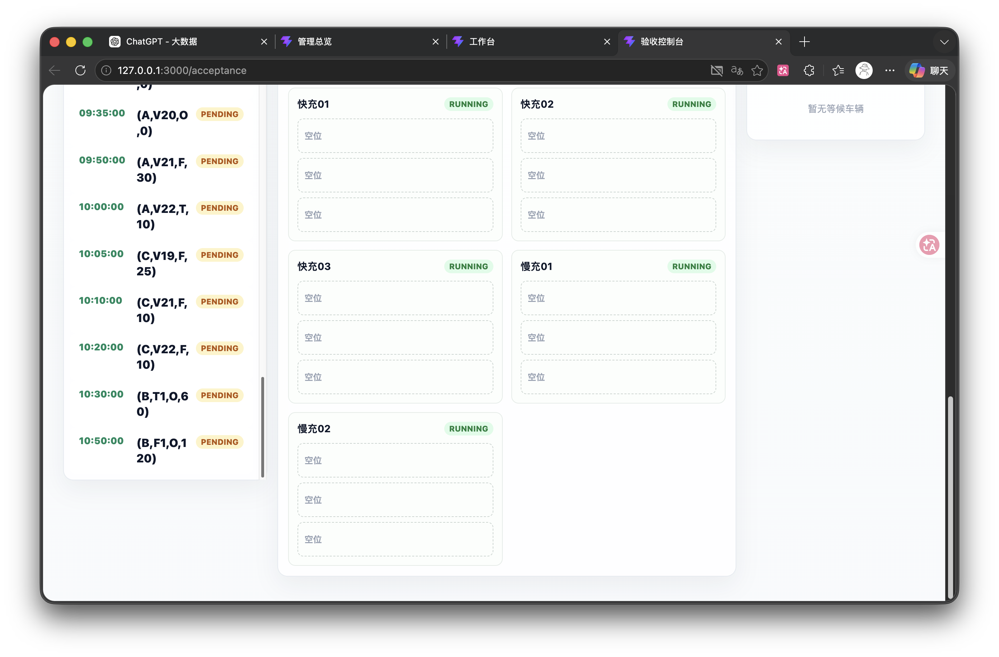
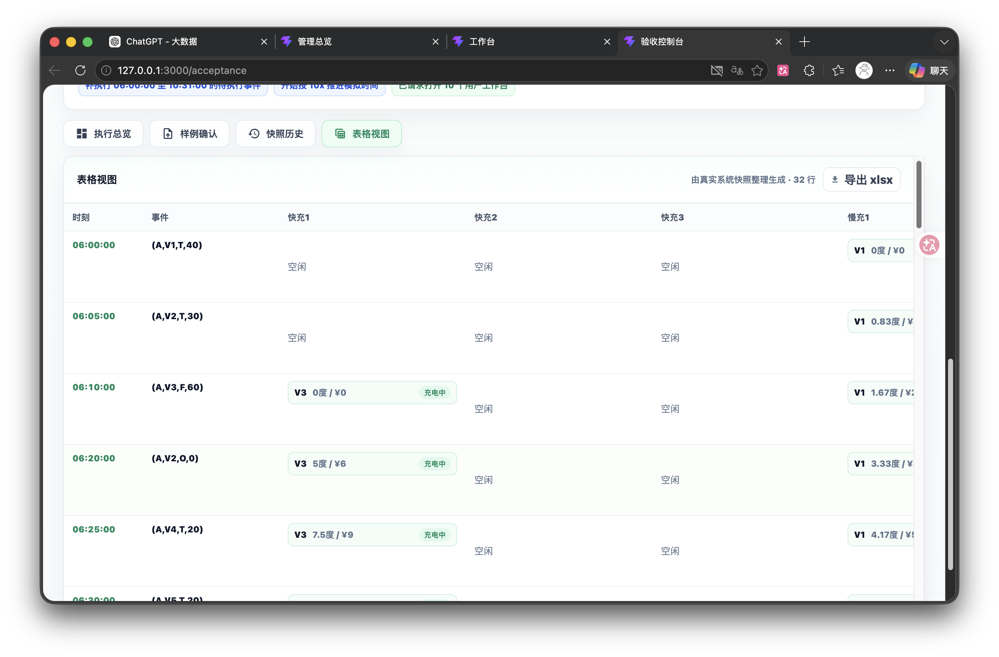
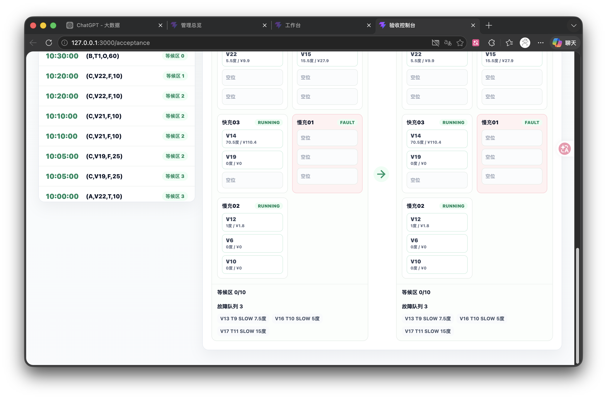
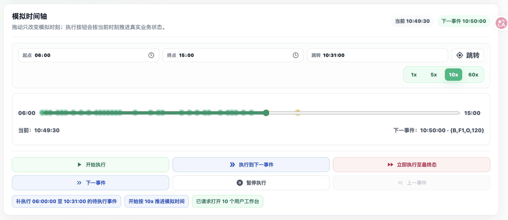
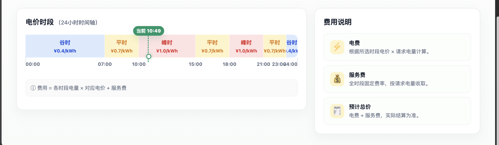
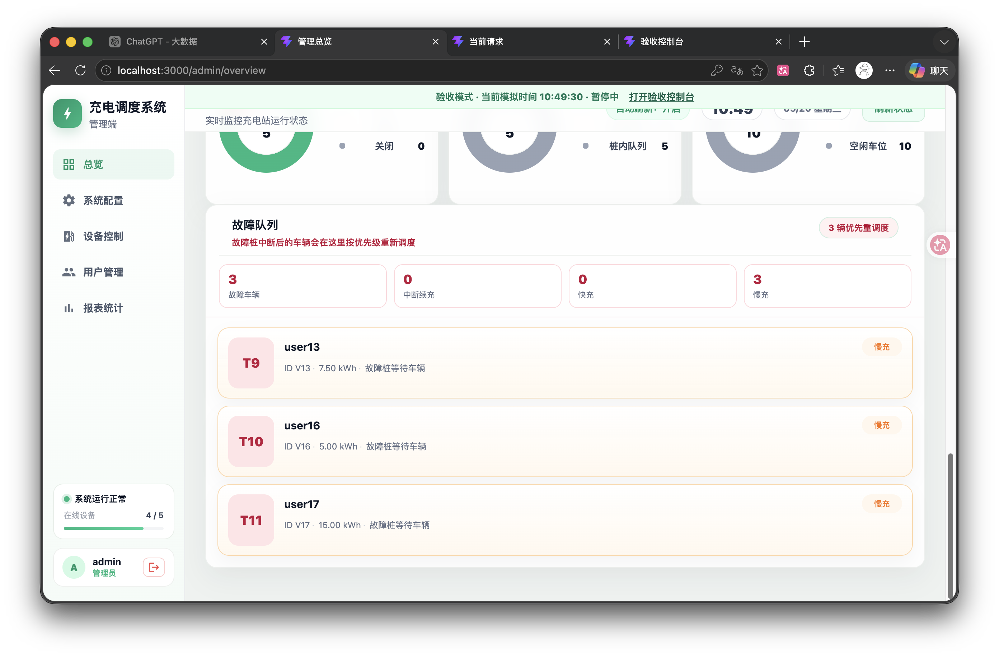

1、验收控制台的总览下方还是没有对齐。
2、验收控制台表格视图左侧时间事件没有上下居中。
3、快照历史下方也没有对齐。
4、模拟时间轴的上方设计不好看，中间时间轴还是有错位，也不好看，重新设计，下方也缺乏设计感。
5、还是错位了。
6、工作台底部没有对齐。
7、故障队列显示应该放在等候区下方，而且设计的不美观，格格不入。应该与等候区的设计风格类似，但是又不能完全一致
8、成员 C 这版把“有 xlsx 待执行事件”当成了时间轴播放的前置条件，导致没有载入 xlsx 时，手动挡无法用“开始执行”推动模拟时间。（已修复）
