[P0]：严重影响功能使用，必须修复；[P1]：影响用户体验，建议修复；[P2]：其他问题，最低优先级。
### 一、普通调度模式
- [x] 1.用户自己不能修改电池容量
- [x] 2.[P0]账单为什么显示的是“当前浏览器已记录的请求”
- [x] 3.用户看不到已充电的百分比
- [x] 4.[P0]退出登录后，用户看不到当前状态。只显示“本地缺少请求编号，前端无法直接查询详情。请由管理员结束该请求后重新提交。”
- [x] 5.[P0]管理端标记故障后，用户被强制中断，没有自动重新排队。管理端重新恢复该充电桩后，用户端显示的还是“故障中断”，而管理端显示的却是在为该用户充电中。
- [x] 6.[P0]管理端查看的队列显示的是用户ID，应该显示用户名。“当前服务”应该显示出服务的用户对象（用户名）
- [x] 7.[P0]充完电，管理端一直显示“充电中，还需 0 min”。
- [x] 8.用户端在进入桩队列后，“前车数量”显示为0，应该显示当前位于桩队列的位置。
- [x] 9.发生故障中断后，用户端的时间线中并没有显示，而是直接显示了“充电中”（无缝衔接到另一个充电桩了）。
- [x] 10.管理端无法看到等候区的情况，修改后能看到，但是没有后端接口，请求编号、模式、电量需后端补充后才能精确展示；此处用活跃用户减去桩队列用户得到等候区候选列表。已补充管理端等候区后端接口，由后端直接返回等候区请求编号、排队号、充电模式、请求电量、预计等待信息和用户信息，前端不再通过活跃用户减去桩队列用户推测等候区。
- [x] 11.前端UI有待优化，过于简陋，缺乏用户体验设计，动画、交互等方面都欠佳，布局也不够美观，颜色搭配也不够合理，整体感觉很粗糙，留白太多，AI卡片式布局特点明显，缺乏创新和个性化设计，死板僵硬，而且页面设计凌乱，缺乏层次感和逻辑性，用户很难找到需要的功能和信息，使用起来也不够流畅和舒适。
- [x] [P0]12.在同一个浏览器不能同时登录两个账号，会导致数据混乱，用户A登录后，用户B登录，A发送充电请求，后台发现其实是B发送的，刷新后，A的登录态变成了B。
- [x] 13.提交充电请求后，会在提交请求按钮的下方显示一个小卡片，但是卡片内的数据没有实时更新，比如“正在充电”状态时，还是显示“等候区等候”状态。刷新后，该卡片消失不见。
- [x] [P0]14.充电桩故障与时间顺序重排存在边界问题。
  - 作业原文要求：若单一充电桩故障且该桩有车排队，则正在被充电的车辆停止计费，本次充电过程生成一条详单；此后系统重新为故障队列中的车辆进行调度。时间顺序调度要求暂停等候区叫号服务，将其它同类型充电桩中尚未充电的车辆与故障候队列中车辆合为一组，按照排队号码先后顺序重新调度。故障恢复时，也要求将其它同类型充电桩中尚未充电的车辆合为一组，按照排队号码先后顺序重新调度。
  - 修复前实际表现中，故障桩队首正在充电车辆被故障中断后，会生成剩余电量的新请求，并重新取得新的排队号。这样会导致该车剩余任务丢失原排队优先级，可能排到故障桩队尾车辆之后，与“故障队列中车辆按排队号码先后顺序重新调度”的作业语义不一致。
  - 复现快照一：初始状态为 `桩1: user03(32)`、`桩2: 故障`、`桩3: user02(29) user04(31)`，括号为排队序列，队首车辆正在充电。此时标记桩3故障，理论上 `user02(29)` 应停止计费并生成详单，但其剩余充电任务仍应作为故障队列车辆参与后续调度，且排序优先级应早于 `user04(31)`。修复前实际状态会变为 `桩1: user03(32) user04(31)`、`等候区: user02(33)`，其中 `user02` 因新建剩余请求取得新排队号 `33`，排到了 `user04(31)` 后面，调度顺序不合理。
  - 复现快照二：先关闭桩2、桩3，再让 `user01~user04` 依次发起请求，充电量分别为 60、50、40、30，此时状态为 `桩1: user01(34) user02(35)`、`等候区: user03(36) user04(37)`。随后依次开启桩2、桩3，当前实际状态为 `桩1: user01(34) user02(35)`、`桩2: user03(36) user04(37)`、`桩3: 空闲`。该现象的原因是普通启动充电桩时只按普通调度从等候区补位，不会将其它桩中尚未充电车辆重新合并重排。作业原文没有明确规定普通启动/关闭桩时必须采用时间顺序重排，因此该点不宜单独判定为违反作业要求，但它会形成后续故障测试中的非全局时间顺序状态，需要在测试记录中说明。
  - 修复方式：保留“故障中断生成详单 + 剩余电量生成新请求”的实现模型；但剩余电量新请求会作为本次故障队列候选参与调度，排序时优先使用源请求的排队号，不再使用新请求排队号决定本次故障重排优先级。`PRIORITY` 下，故障队列车辆优先于普通等候区车辆补位；`TIME_ORDER` 下，故障队列车辆与其它同类型桩中尚未充电车辆合并后按排队号重排。

- [x] 15.管理端总览页，查看各桩的状态，各桩的队列需要点击后出现弹窗才能看到，非常不方便，无法同时看到所有桩的队列情况。类似的设计在用户管理页也存在，需要点击“详情”后才会弹窗显示详单，无法同时看到多个用户的详单。但是同时显示所有桩的队列情况和用户的详单又会存在信息过载的问题，需要权衡设计。已在总览页每个充电桩卡片内显示队列摘要，保留弹窗用于查看完整队列；用户管理页改为表格内展开详情行，可同时展开多个用户的详单，以减少弹窗切换造成的信息遮挡。

- [x] [P0]16.时间轴的起始和终点时间无法修改，而且当实际运行至终态的时间超过了时间轴的终点时间时，会出现bug。
- [x] [P1]17.验收控制台左侧的事件列表总览显示不美观，出现了换行，可能是不同电脑的适配问题？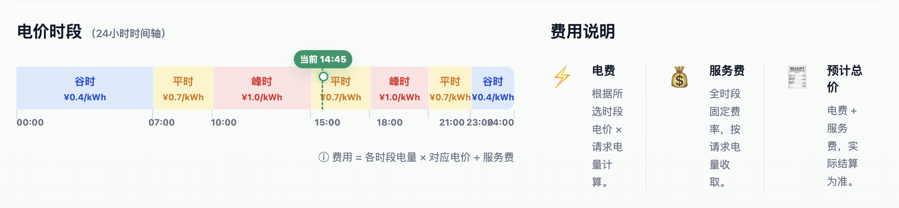
- [x] [P1]18.快照历史的左侧事件列表应该用可滑动的列表展示，而不是直接显示在页面上。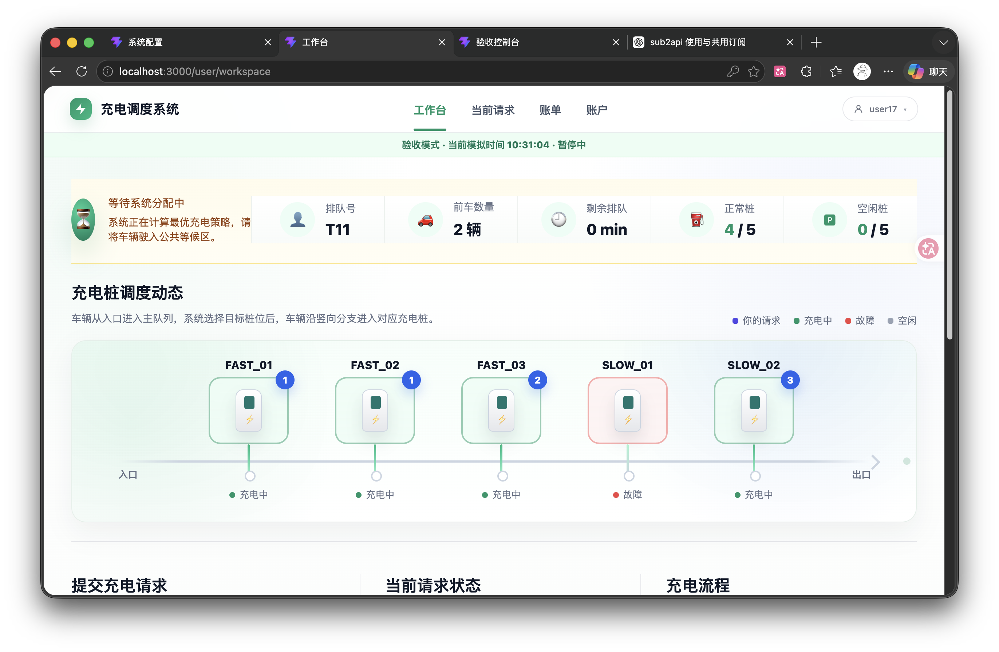
- [x] [P2]19.管理端总览页故障队列中的车辆应该显示车号而不是排队号，而且与上面的一块区域的位置应该互换。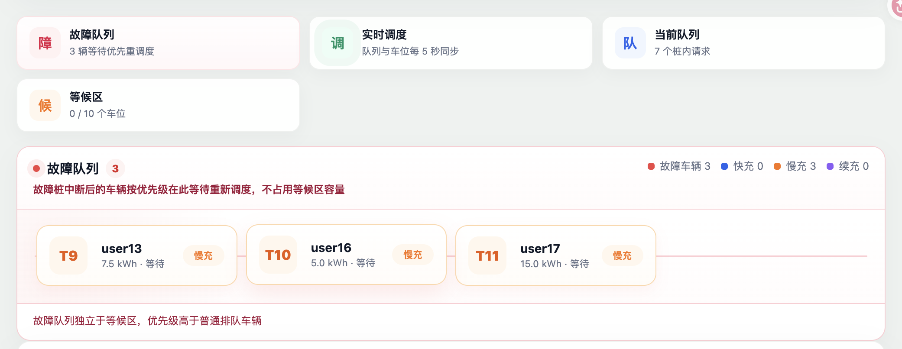
- [x] [P1]20.位于故障队列的车辆，在用户端的工作台的状态那里不应显示“等候区等待”，而是应该显示“故障队列等待”，以区分于普通等候区的状态。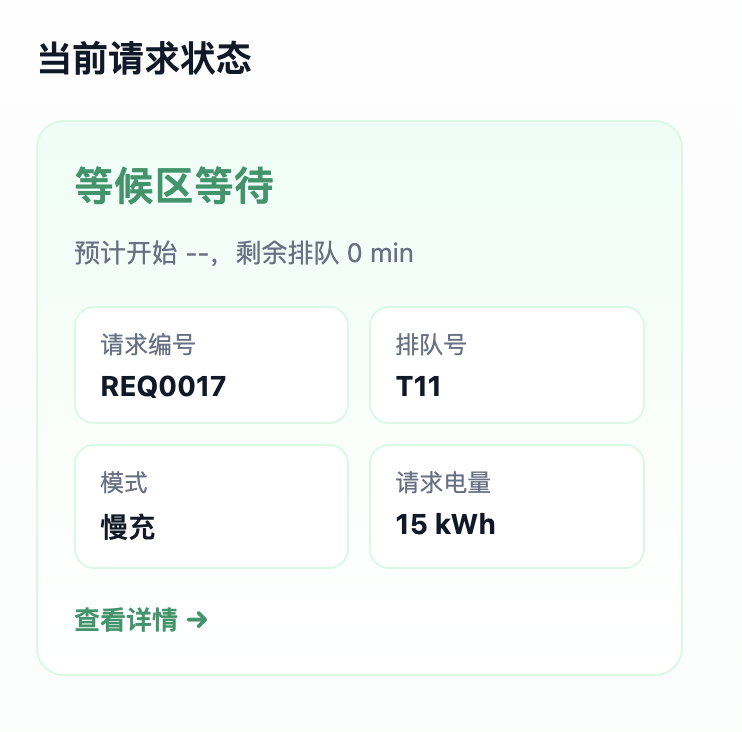
- [x] [P2]21.验收控制台的跳转时间那里的数字没有居中。
- [x] [P0]22.手动模式下，表格视图的如U005，U009是什么，应该是V开头的车号才对，与问题27同源。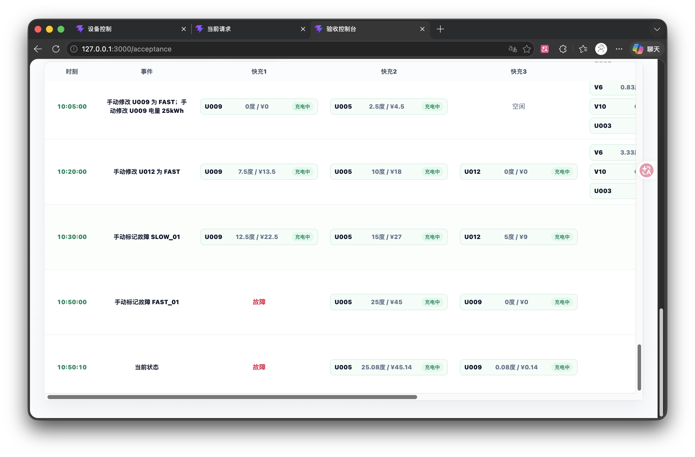
- [x] [P1]23.验收控制台页“验收账号入口”的上方的两行展示没有必要存在。验收账号入口的“...”点击后不是展开而是直接进入user01的页面，“打开所有用户工作台”功能可以删去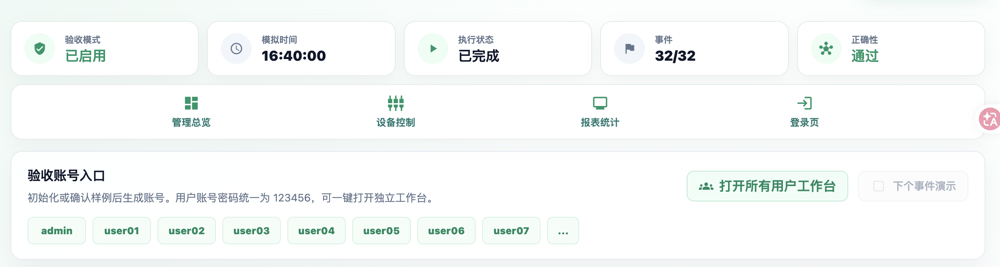
- [x] [P0]24.验收控制台的执行控制部分的按钮太多了，‘开始执行’和‘暂停执行’有一个即可，这两是互斥的，‘开始执行’点完后变成‘暂停执行’，‘暂停执行’点完后变成‘开始执行’。然后保留‘立即执行至最终态’和‘下一事件’即可，其他的没必要。这样就只有三个按钮，做成一行。不允许回溯，时间轴也不允许向后拖动。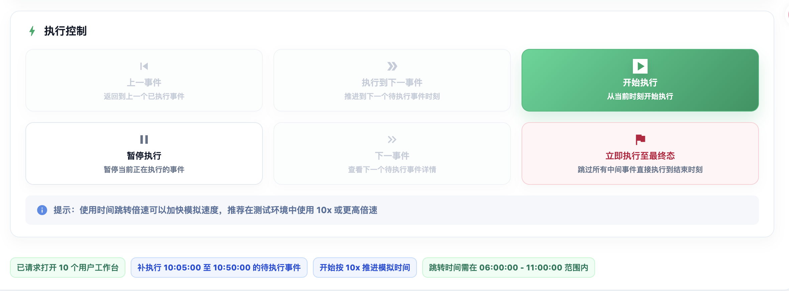
- [x] [P1]25.验收控制台的字体和元素可能太大了，需要频繁拖动才能看到，需要整体变小一点。
- [x] [P0]26.初始化数据库的时候，应该生成22个user账号，电池容量都为100。
- [x] [P0]27.类似问题22，手动模式时，有些用户的ID为什么变成了U开头的，应该是重新注册的原因，初始化数据库只提供了10个user，user11-user22需要我手动注册。应该统一为V开头的。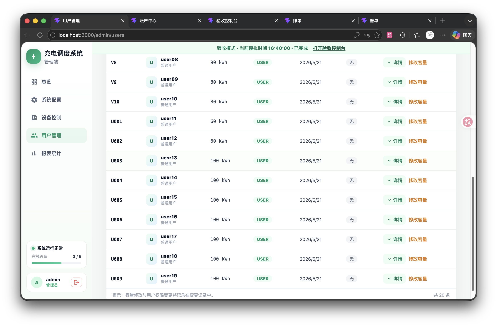
- [x] [P1]28.管理端的用户管理那里应该设计一个‘导出所用用户详单’功能，导出一个Excel表格，包含所有用户的充电详单。格式为：车号(用户ID)、分配的桩号、充电开始时间、充电结束时间、充电电量、充电费、服务费、总费。类似于如图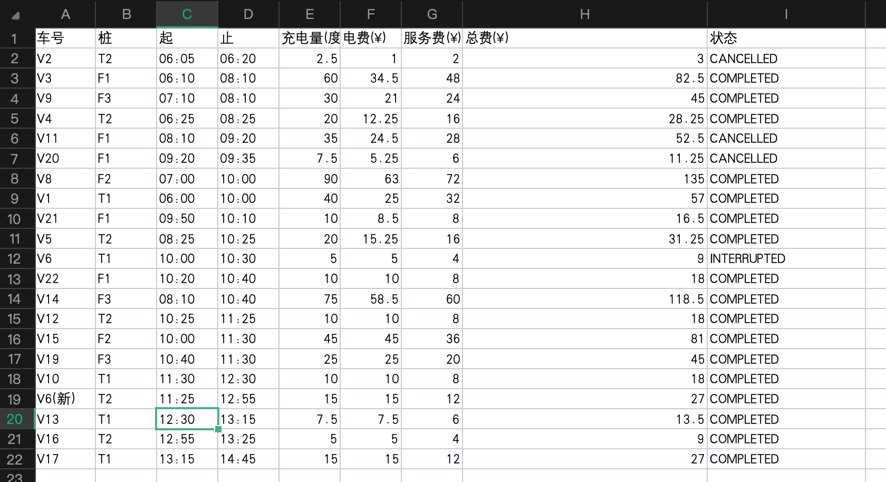
- [x] [P2]29.接入支付接口，模拟即可（点击即为支付成功）。
- [x] [P0]30.默认的故障策略应为“时间顺序调度”，而非“优先级调度”。
- [x] [P2]31.自动模式的‘下个事件演示’功能仍有问题，我想看到肉眼可见的浏览器操控，不要速度过快导致看不清发生了什么。我的预期是：开启‘下个事件演示’后，当模拟时间轴运行到下个事件对应的时间点时，暂停时间轴，然后操作浏览器自动执行该事件对应的操作（比如用户发起充电请求、充电桩故障等），需要能看到操作过程（比如输入、鼠标点击等），操作完成后再继续时间轴的运行。这是不是要使用一些浏览器自动化工具？比如selenium等。
- [x] [P1]32.载入xlsx验收用例是否兼顾了mac、windows和linux系统，或者说不知这个功能，整体是否有不兼容的情况。

- [ ] [P2]33.‘下个事件演示’功能仍有问题，还是无法看到肉眼可见的浏览器操控。

- [x] [P1]34.启用和关闭验收模式已合并为一个状态按钮，未启用时显示“启用验收模式”，启用后切换为“关闭验收模式”。
- [x] [P1]35.验收控制台总览页左侧事件列表已改为按视口高度自适应的独立滚动列表，避免不同屏幕尺寸下底部内容被截断。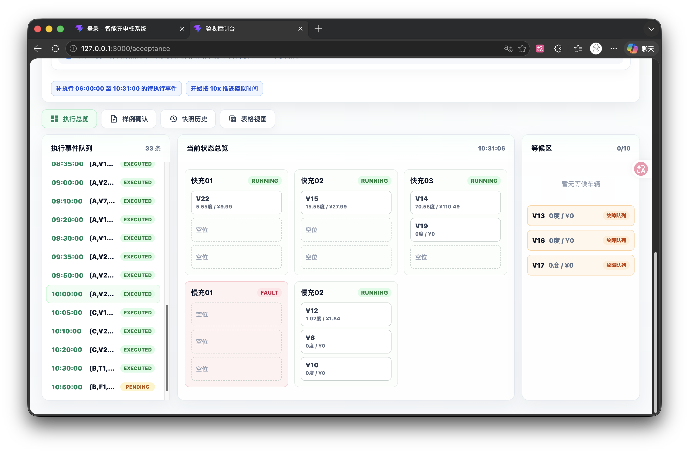

- [x] [P1]36.管理端用户列表一页显示所有用户，需要滑动很远，不便于阅读。建议可以分页，并且可以选择每页显示的用户数量，比如10、20、全部等。
- [x] [P2]37.backend文件夹中的.venv和venv，以及.env.example的问题，到底保留哪个？运行时载入哪个？

- [x] [P0]38.如下情况：
  - T桩1: 01(10) 02(60) 03(50)
  - T桩2: 04(30) 05(40) 06(30)
  - F桩1: 空闲
  - 等候区: T07(10)
  充电桩10kwh，括号内表示剩余充电量，T表示慢充，等候区T07表示07需要慢充桩，每个桩队列只有三个位置，第一个表示正在充电。一个小时后，又来了几辆车，变为：
  - T桩1: 02(60) 03(50) 空
  - T桩2: 04(20) 05(40) 06(30)
  - F桩1: 空     空      空
  - 等候区: T07(50) F08(10) F09(10) T10(10)
  
  此时如何调度？按照作业要求的等待时间最短来调度，从等候区叫号，07应该排到T桩2队列，但是T桩2已满，所以应该继续在等候区等待。但是F08应该回应叫号，排到F桩1。这样，T桩1一直会有一个位置空着，直到04完成充电，07进入T桩2队列，这时，T10才可以进入T桩1队列。这会导致实际容量会变小，因为有存在充电桩有空位，但是等候区不空的情况。

- [x] [P1]39.目前无论是充电桩队列正在充电、等待、故障队列等待、还是等候区等待，在用户端和管理端只显示了排第几位，没有显示预计等待时间。用户端有相关的UI设计，但是显示的都是0.0min，貌似没有相关的接口。
- [x] [P0]40.acceptance_service.py (line 762) 现在对 QUEUED/CHARGING 状态下“模式不变、只改电量”的 CHANGE 会放行。根据作业要求，正在充电的车辆，不允许修改充电请求，只能提前结束充电。

- [x] [P1]41.管理端充电桩队列总览查看充电桩队列详情时，正在充电的车辆应该显示剩余充电量和预计完成耗时，而不是请求电量。等待的车辆要可见预计等待时间。等候区应该显示用户ID而不是排队号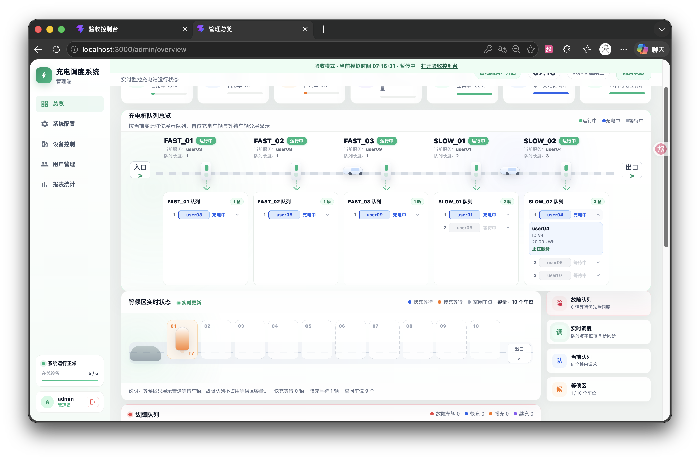
- [x] [P1]42.类似问题9，用户端的‘进度时间线’没有严格记录充电过程中的每个状态变化事件，之前修复过故障的状态变化，现在发现修改充电请求等异常状态变化没有记录在时间线中，导致时间线显示不完整，并且账单页的‘充电过程’（如下图）也是类似的情况。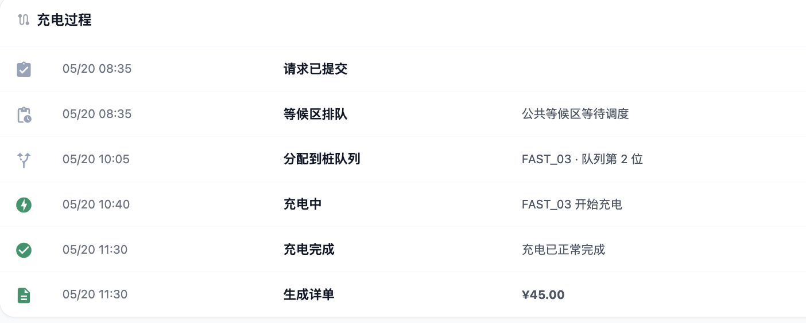
### 二、单次联合调度模式

### 三、批量调度模式

## 目前已修复的bug原因
1.对于 **一.2/4/5/7** 问题，是由于前端采用了浏览器LocalStorage来存储一些数据，而未全部使用数据库，造成严重的后果。
2.对于 **一.36** 问题，是用户管理前端一次性展开全部用户；已改为10/20/全部分页切换。
3.对于 **一.37** 问题，是本地虚拟环境和配置模板口径不清；已在后端README明确推荐 `.venv`，`venv` 为历史本地目录，`.env.example` 仅作模板。
4.对于 **一.39/41** 问题，是前端用真实浏览器时间计算模拟时间，且管理端队列接口字段不足；已补充剩余等待/剩余充电/剩余电量字段并优先展示。
5.对于 **一.42** 问题，是修改请求未写入生命周期日志；已补充修改模式/电量事件，并在用户端时间线和账单充电过程展示。
